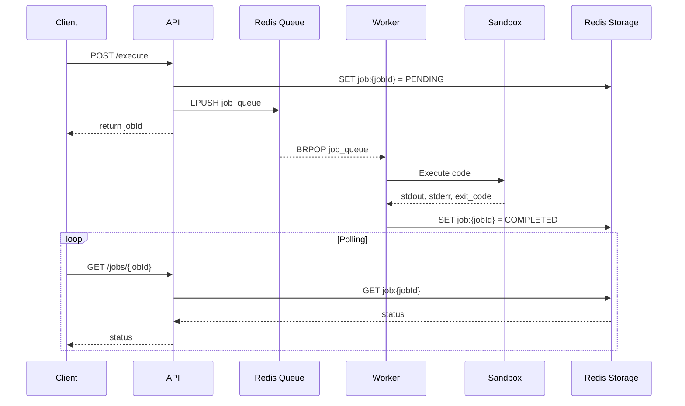

## [이전 글](https://ljweel.github.io/posts/onpyrunner09/) 요약
- 테스트 자동화
- nsjail log 처리 및 cgroup 설정

## 배포 및 UI 제작
이제 MVP는 거의 제작된거 같아서 배포 및 UI 제작을 해야한다. 배포는 vulcan님의 도움을 받아 vulcan 서버에서 하게 되었고, 클플 터널링 + nginx로 리버스 프록시를 해서 기존에 존재하던 서비스와 충돌하지 않게 했다. ui는 [run.xo.dev](run.xo.dev)를 참고해서 중앙을 기준으로 좌를 code, stdin을 입력하는 곳, 우를 stdout, stderr 를 보여주는 곳으로 했다. 

## 전체적인 구조 정리

### Excution Flow(Sequence Diagram)
전체적인 실행흐름을 시퀀스 다이어그램으로 나타내면 다음과 같다.

다른 것도 정리했는데 여기보다는 [여기](https://github.com/ljweel/OnPyRunner/blob/main/docs/architecture.md)에 작성했다.

## 드디어 오픈

[ljweel.dev](https://ljweel.dev)처럼 nginx로 호스팅했다.
- run.ljweel.dev -> 사이트 UI(html + js)를 담당
- run.ljweel.dev에서 /execute와 /jobs/{jobId} -> api endpoint

[run.ljweel.dev](https://run.ljweel.dev) 해당링크에서 실행해볼 수 있다.
