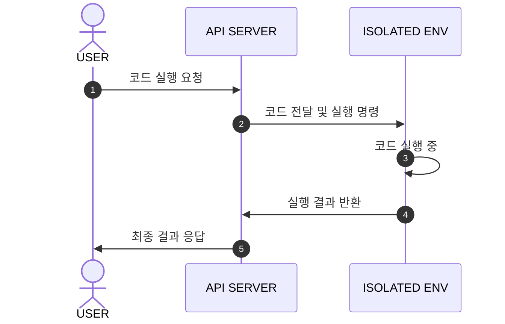
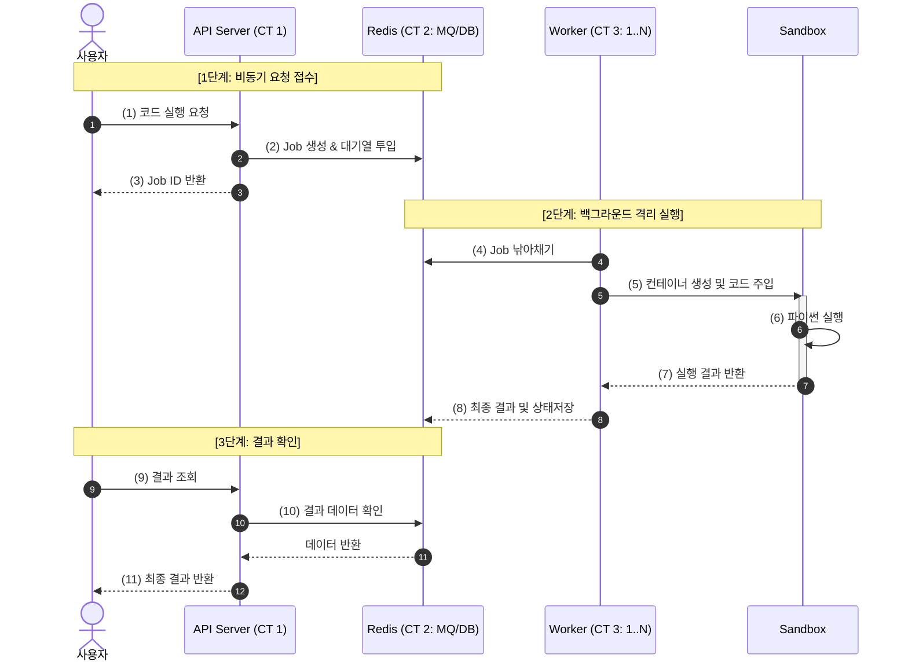

## 어쩌다 만들게 되었나
백준 문제를 풀다보면 폰으로 코딩하는 일이 빈번하다. 사실 온라인 파이썬 실행기는 많이 있다. 하지만, 많은 사이트들을 찾아봤는데 아쉬웠던 것은
- 최신 버전의 파이썬이 아니였다.
- pypy가 지원되지 않았다.
- 폰코딩이 가능하고, 편리하다.

정도의 주요한 이유가 있었다.

내가 알고리즘 문제를 풀 때 가장 유용하게 썼던 것은 [tio.run](https://tio.run/#python38pr)인데 이거에 기반으로 좀 프로젝트 영감을 얻었긴 하다. ~~사실상 python 최신버젼이 가능한 tio.run~~ 물론 설계나 아키텍쳐, 프레임워크 공부 같은 이유도 있긴하다.

## 주요 기능 정리

그래서 내 프로젝트에는 어떤 주요 기능이 있는지 고민해 보았다.

- **코드와 입력이 주어질 때, 실행 버튼을 누르면 출력해주기 (가장 중요)**
- TBD

해당 기능에 대해서 유스케이스를 생각해보았다.
1) 유저가 코드와 입력을 작성 후 실행 버튼을 누름
2) 코드와 입력을 건네 받아 컨테이너 같은 공간에서 파이썬을 실행시키고 출력
3) 받은 출력을 유저에게 보여주기

이를 다이어그램으로 그려보면

## 가장 큰 문제점

- 보안적으로 문제가 없나? os.system('rm -rf')같은걸 어떻게 막을 건데?
  - Sandbox 컨테이너 격리
- 자원 독점 관리: while True: pass 하면 CPU 다 먹는데?
  - CPU 점유율 관리와 메모리 제한 설정
- 동시 접속자가 늘면 코드 실행 끝날때까지 블로킹
  - 메세지 큐 기반으로 비동기 처리

## 개선 후 다이어그램

이런 식으로 전체적으로 처음에 생각했던 3단계를 세부적으로 쪼갰다.
