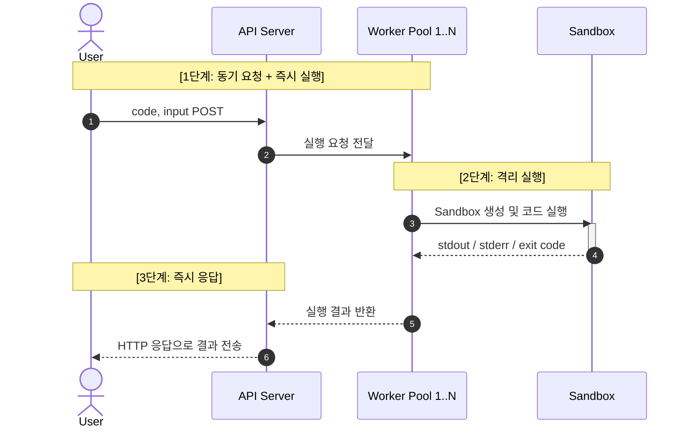

## [이전 글](https://ljweel.github.io/posts/onpyrunner03/) 요약
- express와 redis의 bullMQ 도입
- api 호출해서 worker까지 연결되는지 테스트

## 설계의 미스

코딩을 하다보니 뭔가 이상함을 느꼈다. 
**사용자가 jobId로 실행결과를 요청해야하는 구조가 내가 원하던 실행기의 모습인가?** 라는 생각이 들었다.
그래서 전반적인 설계를 다시 돌아보고, 다시 기본적인 유스케이스로 돌아가 생각했다. 

가장 처음에 내가 원했던 방식은 
**온라인에서 Python 코드를 실행**시켜주는,
[**tio.run**](https://tio.run/#python38pr)같은 간단한 실행기였다.  

다시 돌아보면서 들었던 생각은 "POST 요청을 굳이 비동기로 처리해야하는가?", "비동기를 위해 redis가 정말로 필요할까?" 였다.

**결과적으로 비동기는 필요가 없었다.**
내가 원하던 것은 간단한 코드를 실행시켜주는 실험 환경이였지만, 설계를 하다가보니 본질을 잊은 것이다.

## 어디서부터 잘못된걸까?
설계를 할 때 한 생각을 블로그에 정리해서 올렸기 때문에 어디서 미스가 난건지 파악할 수 있다. 문제는 [여기](https://ljweel.github.io/posts/onpyrunner01/#%EA%B0%80%EC%9E%A5-%ED%81%B0-%EB%AC%B8%EC%A0%9C%EC%A0%90)였다.

**동시 접속자가 늘면 코드 실행 끝날때까지 블로킹** 문제를 **메시지 큐 기반 비동기 처리**로 자연스럽게 넘어갔는데, 메시지 큐를 통한 비동기는 병목 현상에 해결책이 될 수 없었던 것이다.

조금 생각해보면 알 수 있는데, 코드 실행 컨테이너가 N개면 N개가 넘었을 때의 병목을 처리하는 방법은 컨테이너의 수를 늘리는 방법말고는 없다. 물리적으로 어쩔 수 없는 문제였다. **비동기는 병목을 해결해주지 않는다.**

## 개선 후 다이어그램

## 동기 실행의 이유
결국 OnPyRunner는 동기 실행 구조가 되었지만 항상 동기 실행이 맞는 것은 아니다. OnPyRunner가 동기 실행이 된 이유는 사용자가 작성한 코드를 바로 실행시켜서 결과를 알려주는 것이 내 목표였기 때문이다.