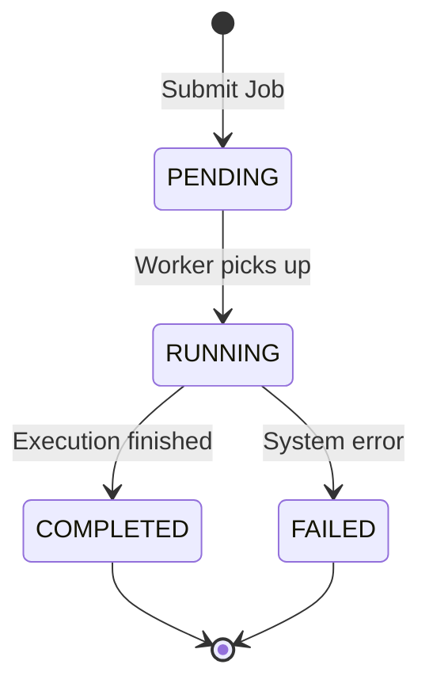

## [이전 글](https://ljweel.github.io/posts/onpyrunner06/) 요약
- Redis를 사용한 웹 - 큐 - 워커 아키텍쳐


## job 상태 다이어그램

job의 상태 정의
- PENDING: 아직 RUNNING이 아닌 상태
- RUNNING: 실제로 실행됨.
- COMPLETED: 실행이 완료됨. 코드의 결함은 사용자의 책임
- FAILED: 실행이 실패함. 시스템 설계의 책임.

Runtime Error는 COMPLETED일까 FAILED일까?  
-> **job실행 상태**를 기반으로 정의하는 거지, 파이썬 코드의 성공 여부를 따지는 것이 아니므로  COMPLETED에 속함. 
> COMPLETED는 사용자의 책임, FAILED는 시스템 설계의 책임




## api 설계
job의 상태 다이어그램을 기반으로 post와 get의 요청과 응답의 구성요소를 설계한다.
- response의 최소 구성 요소
  - job_id, job_status는 항상 있어야한다. job_id가 있어야 job의 결과를 알 수 있고, job status가 있어야 현재 작업 상태를 알 수 있다.

### POST /execute
- request
  - 필수적인 것: language, source_code   
  - 없으면 default로: input, limits(3초/128MB)
- response
  - 필수적인거 job_id, status(PENDING)
- 기본적인 의사코드
    ```
    def execute(request):
        validate request
        create job id
        create execution worker_job for worker
        enqueue worker_job to redis queue
        create initial job state (PENDING)
        save job state in redis
        return job state as response (PENDING)
    ```

  - worker에게 갈 job의 정보(queue에 들어갈 정보)와 db에 저장해놓을 job 정보는 다르기 때문에 서로 분리해서 생각해야 한다.
  - queue에 들어갈 정보는 코드, 입력, 제한 등등이 있지만, 해당 내용까지 db에 저장할 필요는 없다.

### GET /jobs/{job_id}
- response
  - job status에 따라 분리하여 설계
  - PENDING/RUNNING
    - 필수: job_id, status
  - COMPLETED
    - 필수: job_id, status, result(stdout, stderr, exit_code, execution_time_ms)
  - FAILED
    - 필수: job_id, status, reason(실패 사유)
- 의사 코드
    ```
    def get_job(job_id):
        load job state from redis
        convert job state to json
        return job state as response
    ```
