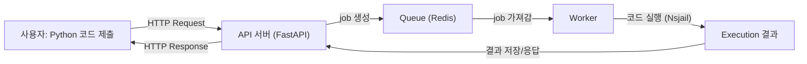
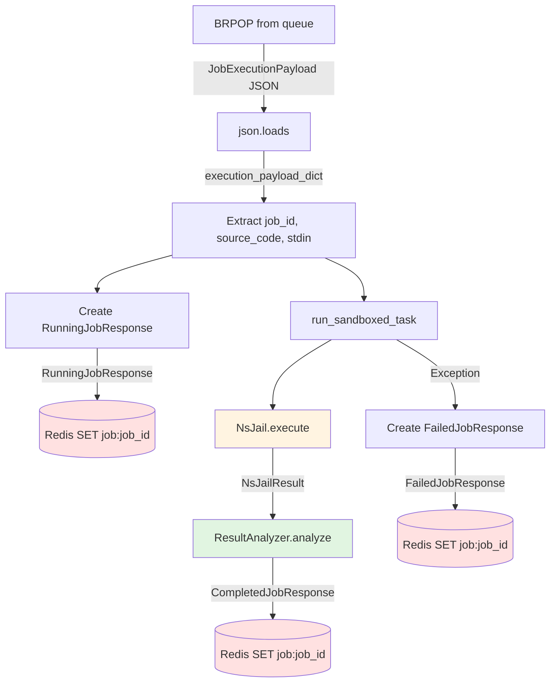

## [이전 글](https://ljweel.github.io/posts/onpyrunner07/) 요약
- job 상태 전이 다이어그램
- api 설계 및 의사 코드


## worker가 job를 가져가는 법
이전 글에서 그려놓은 job의 상태 전이 다이어그램과 api 설계를 바탕으로 코딩을 했다. 지금까지 설계의 흐름을 job에 관한 flow chart로 아래에 만들어보았다.  

이전 글에서는 HTTP Request, HTTP Response, job 생성, 결과 저장/응답 까지 설계했다.  
그래서 worker.py를 짜야하는데 위 흐름도에서 코드 실행(Nsjail) + 결과 저장 / 응답에 해당한다. worker가 하는 일을 의사코드로 나타내               면 다음과 같다.


```plain
1. queue에서 payload pop
2. payload json 에서 dict로 변환 
3. job의 상태를 RUNNING으로 바꾸기
try:
4.   샌드박스 실행 후 결과 받기
5.   result를 분석 후 response로 변환
6.   job completed Response
except:
7.   job Failed Response
```

## 추상화하기
**4. 샌드박스 실행 후 결과 받기** 라는 부분에 대해 코드 작성이 어려웠다. 왜냐하면 샌드박스 실행이라고 뭉뚱그려 생각한 것의 실제 과정은  
1. 샌드박스 폴더를 만들고, 
2. 코드와 입력을 파일에 작성하고, 
3. config파일을 고려해서 nsjail이 생성
4. 생성 후 샌드박스 실행  
5. 생성한 샌드박스 폴더 삭제


이라는 일련의 과정이 존재하기 때문이다.
그래서 저런 일련의 과정들을 모두 worker.py에 적기 보다는 nsjail.py 라는 파일을 만들어서 거기에서 nsjail class를 만들고자 했다. [python-discord/snekbox](https://github.com/python-discord/snekbox/blob/main/snekbox/nsjail.py)에서 만든 nsjail class를 참고했다.

nsjail 클래스를 만들어서 (source_code, stdin) -> NsjailResult 를 추상화했다.


## Worker 흐름도와 Analyzer

지금까지의 worker에서의 데이터 흐름은 아래와 같다.

위와 같이 이루어지는데, NsjailResult를 분석해서 CompletedJobResponse로 만들어야 하기 때문에, 초록색 부분인 ResultAnalyzer.analyze를 통해 exit_code, stderr등을 보고, TLE, MLE, RTE 등을 분석하게 된다. 일단은 추상화를 해놓고 내부 구현을 간단히 한 후 동작하는지를 테스트해볼 예정이다.


## 참고자료
- [How to design a scalable, distributed background worker using only Redis and pure Python](https://python.plainenglish.io/i-built-my-own-job-queue-in-python-a-celery-style-task-system-from-scratch-4e67dd72b2e8)
- [python-discord/snekbox](https://github.com/python-discord/snekbox/blob/main/snekbox/nsjail.py)