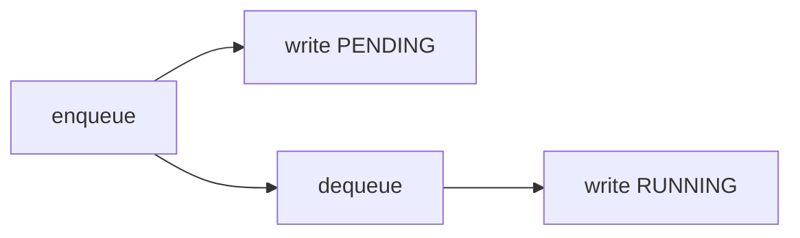
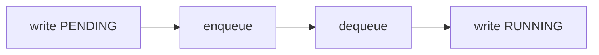

**경쟁 상태(Race Condition)** 란 두 개 이상의 프로세스나 스레드가 공유 자원에 접근할 때, 실행 순서에 따라 결과가 달라지는 현상입니다.

## 문제
이번에 OnPyRunner를 개선하면서 실제로 경쟁 상태를 하나 만났습니다.

처음 작성한 코드의 흐름은 다음과 같았습니다.

| API Server | Worker |
|---|---|
| 1. 큐에 작업 추가 | |
| 2. Redis에 PENDING 기록 | |
| | 3. 큐에서 작업 꺼내기 |
| | 4. Redis에 RUNNING 기록 |

저는 당연히 Job의 상태가 `PENDING -> RUNNING` 순서로 기록될 것이라고 생각했습니다.

하지만 API Server와 Worker는 서로 다른 프로세스입니다. 실제 실행은 다음과 같이 섞일 수 있습니다. 아래와 같이 말이죠.

| API Server | Worker |
|---|---|
| 1. 큐에 작업 추가 | |
| | 2. 큐에서 작업 꺼내기 |
| | 3. Redis에 RUNNING 기록 |
| 4. Redis에 PENDING 기록 | |

그러면 이미 실행 중인 Job의 상태가 다시 `PENDING`으로 돌아갑니다. 이렇게 되면 망합니다.

제가 보장하고 싶었던 것은 `PENDING -> RUNNING` 이라는 상태의 순서였지만, 기존 코드에는 이 순서를 보장하는 것이 없었습니다.


## 해결

해결 방법은 `PENDING`을 기록한 뒤 큐에 작업을 넣는 것입니다.

| API Server | Worker |
|---|---|
| 1. Redis에 PENDING 기록 | |
| 2. 큐에 작업 추가 | |
| | 3. 큐에서 작업 꺼내기 |
| | 4. Redis에 RUNNING 기록 |

이렇게 바꾸면 순서는 다음과 같습니다.

`PENDING 기록 -> enqueue -> dequeue -> RUNNING 기록`

Worker가 `RUNNING`을 기록하려면 먼저 큐에서 작업을 꺼내야 하고, 작업을 꺼내려면 API Server가 먼저 작업을 큐에 넣어야 합니다.

따라서 Queue가 가진 순서 제약을 이용하면 `PENDING`이 기록되기 전에 `RUNNING`이 기록되는 실행 순서를 만들 수 없습니다.

## 왜 이렇게 해도 되는가?

이번 경우 Job의 상태를 변경하는 주체는 하나가 아니었습니다.

- API Server: `PENDING` 기록
- Worker: `RUNNING` 기록

따라서 공유되는 상태를 볼 때 **누가 이 상태를 변경할 수 있는지** 확인해야 합니다.

그다음 각 주체가 수행하는 연산을 나열해볼 수 있습니다.

```text
API Server
PENDING 기록
enqueue

Worker
dequeue
RUNNING 기록
```

여기서 중요한 것은 코드에 적힌 순서 자체가 아니라 **서로 다른 주체의 연산 사이에서 어떤 순서가 실제로 보장되는가**입니다.

기존 코드에서는

```text
API Server: enqueue -> PENDING
Worker    : dequeue -> RUNNING
Queue     : enqueue -> dequeue
```

의 순서가 보장됩니다.

해당 관계를 그래프로 표현한다면 다음과 같이 나옵니다. 



이 때, `PENDING -> RUNNING`을 보장해주지 않기 때문에 아래와 같은 흐름도 가능하게 됩니다.

```text
enqueue -> dequeue -> RUNNING -> PENDING
```

여기서 `enqueue -> PENDING`을 `PENDING -> enqueue`로 바꾸어 흐름을 강제하게 되면 상태가 역전되는 현상을 막을 수 있습니다.


## 다음에는 어떻게 발견할 수 있을까?

이번 문제는 코드 두 줄의 순서를 바꾸는 것으로 해결됐습니다. 하지만 다음에도 같은 종류의 문제를 발견할 수 있어야 합니다.

정리해보자면, 
무엇을 고려해야하는지는 다음과 같습니다.

1. 데이터를 변경하는 주체
2. 각 주체는 어떤 연산에 관여하는지
3. 연산들 사이에서 보장되는 순서
4. 보장되지 않는 순서를 바꿔보았을 때 깨지는 상태가 존재하는지

이번 문제에서는 4번의 답이 `RUNNING -> PENDING`이었습니다.


그렇다면 이런 상태가 역전되는 현상을 사전적으로 test를 통해 막으려면 어떻게 해야할까요?  
상태 흐름 순서 자체를 보장하려면 어떻게 해야할까요?  
저도 몰라서 다음 글에서 다뤄보겠습니다. ㅌㅌ